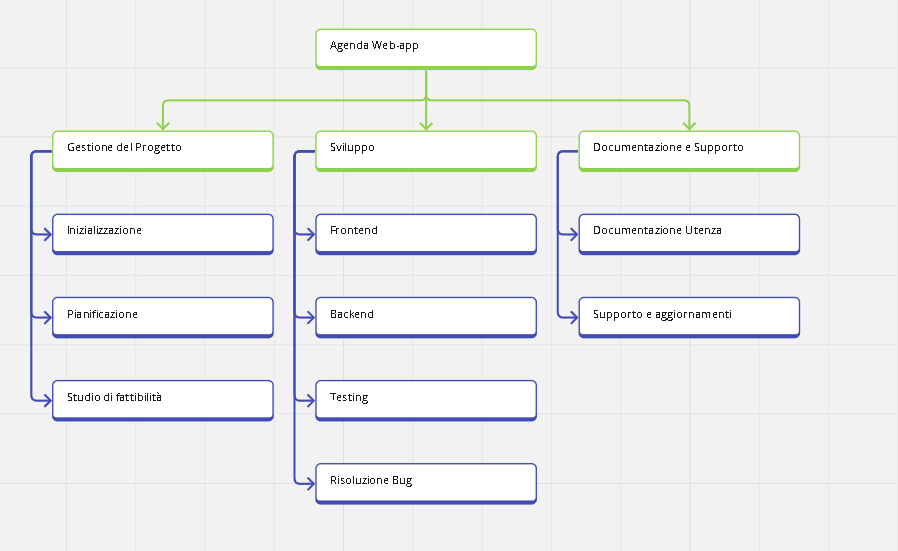

# Agenda-WebApp

## Requirements for the Agenda Web App
### Purpose

The main objective of this web app is to provide users with a tool for daily activity planning and management.

## Functional Requirements
### User Registration
- Tenants (organizations, groups) can register by creating an account with an email address and password. (Admin)

- Users within a tenant can be invited or register using an email address and a password specific to their tenant. (User)

- Both tenant admins and users can log in with their registered credentials. (User, Admin)

### Event Creation
- Users can create events specifying title, date, time, and optionally, description, location, and categories. (User)

- Events are associated with the specific tenant the user belongs to. A user cannot see or edit events from another tenant. (System)

- Users can share events with other users within the same tenant. (User)

### Viewing and Managing Events
- Users can view a calendar showing their upcoming events. (User)

- Users can filter events by date, title, category, or shared status within their tenant. (User)

- Users can edit or delete their own events and events they are shared with within the tenant. (User)

- Tenant admins can view a comprehensive calendar of all events within their tenant. (Admin)

### Notifications
- Users should be able to set notifications for events, with options for email or in-app notifications. (User)

### Search and Filters
- Users can search for events within their tenant by date, title, or category. (User)
- Tenant admins can search for all events within their tenant. (Admin)

## Non-Functional Requirements
### Security
- The web app must ensure the security and protection of user data. (System)
- User passwords must be encrypted during storage. (System)

### Usability
- The application should have an intuitive and user-friendly user interface. (User)
- The interface design should be responsive to support desktop and mobile devices. (System)

### Backup and Restore
- A periodic data backup system for user data should be implemented. (System)
- Users should be able to restore data in case of loss or errors. (User)

### Database
- A database management system should be used to store user data and events. (System)

# UML Diagram

# WBS

# User Stories

## User Registration
* As a user, I want to be able to create a new account using my email address and a password so that I can access the web app.

* As a user, I want to log in with the credentials I provided during registration to access my personalized account.

## Event Creation

* As a user, I want to create events by specifying a title, date, and time to plan my daily activities.

* As a user, I want the option to add additional details to my events, such as description, location, and categories, for better organization.

## Viewing and Managing Events

* As a user, I want to view a list of my scheduled events sorted by date and time.

* As a user, I want to be able to edit or delete events I have created.

* As a user, I want to set notifications for my events, with options for email or in-app notifications, to stay informed about my planned activities.

## Search and Filters

* As a user, I want to search for events by date, title, or category to quickly find the information I need.

* As a user, I want filter options to simplify the viewing of events based on specific criteria.
